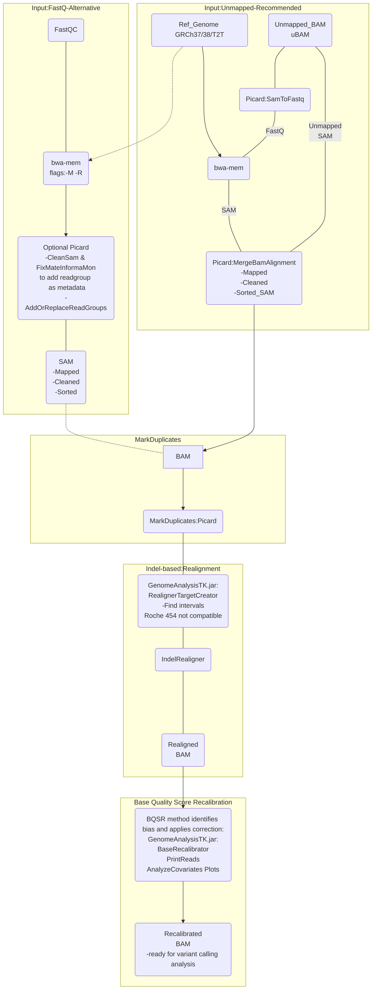

# Mapping & Pre-processing
## GATK best practices
### Notes:

* Bwa-mem mapping tool for genomics data.
* Star v2 for RNA-Seq data.
* uBAM recommended over FastQ

(How to) Generate an unmapped BAM from FASTQ or aligned BAM : [Convert FastQ to uBAM](https://gatk.broadinstitute.org/hc/en-us/articles/4403687183515--How-to-Generate-an-unmapped-BAM-from-FASTQ-or-aligned-BAM)

(How to) Install all software packages required to follow the GATK Best Practices:[ Install software packages guide ](https://gatk.broadinstitute.org/hc/en-us/articles/360041320571--How-to-Install-all-software-packages-required-to-follow-the-GATK-Best-Practices)

ReadGroup important notes: [Meaning of the read group](https://gatk.broadinstitute.org/hc/en-us/articles/360035890671-Read-groups)

Tag @RG must be present for GATK analysis: [@RG error](https://gatk.broadinstitute.org/hc/en-us/articles/360035532352-Errors-about-read-group-RG-information)

<br />

**Used tools:**

**[MergeBamAlignment:](https://broadinstitute.github.io/picard/command-line-overview.html#MergeBamAlignment)**
Merge alignment data from a SAM or BAM with data in an unmapped BAM file. This tool produces a new SAM or BAM file that includes all aligned and unaligned reads and also carries forward additional read attributes from the unmapped BAM (attributes that are otherwise lost in the process of alignment). The purpose of this tool is to use information from the unmapped BAM to fix up aligner output. The resulting file will be valid for use by other Picard tools. For simple BAM file merges, use MergeSamFiles. Note that MergeBamAlignment expects to find a sequence dictionary in the same directory as REFERENCE_SEQUENCE and expects it to have the same base name as the reference FASTA except with the extension ".dict". If the output sort order is not coordinate, then reads that are clipped due to adapters or overlapping will not contain the NM, MD, or UQ tags.

Usage example:
```
java -jar picard.jar MergeBamAlignment \
       ALIGNED=aligned.bam \ 
       UNMAPPED=unmapped.bam \ 
       O=merge_alignments.bam \
       R=reference_sequence.fasta
```
<br /><br />

**[MarkDuplicates:](https://broadinstitute.github.io/picard/command-line-overview.html#MarkDuplicates)**
Identifies duplicate reads.

This tool locates and tags duplicate reads in a BAM or SAM file, where duplicate reads are defined as originating from a single fragment of DNA. Duplicates can arise during sample preparation e.g. library construction using PCR. See also EstimateLibraryComplexity for additional notes on PCR duplication artifacts. Duplicate reads can also result from a single amplification cluster, incorrectly detected as multiple clusters by the optical sensor of the sequencing instrument. These duplication artifacts are referred to as optical duplicates.

Usage example:
```java -jar picard.jar MarkDuplicates \
      I=input.bam \
      O=marked_duplicates.bam \
      M=marked_dup_metrics.txt
```
<br />
<br />

