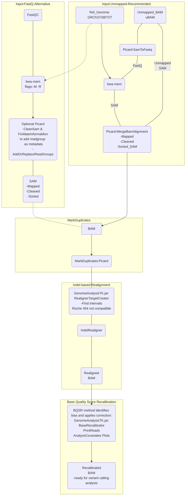

# Mapping & Pre-processing
## GATK best practices
### Notes:

* Bwa-mem mapping tool for genomics data.
* Star v2 for RNA-Seq data.

(How to) Generate an unmapped BAM from FASTQ or aligned BAM : [Convert FastQ to uBAM](https://gatk.broadinstitute.org/hc/en-us/articles/4403687183515--How-to-Generate-an-unmapped-BAM-from-FASTQ-or-aligned-BAM)

(How to) Install all software packages required to follow the GATK Best Practices:[ Install software packages guide ](https://gatk.broadinstitute.org/hc/en-us/articles/360041320571--How-to-Install-all-software-packages-required-to-follow-the-GATK-Best-Practices)

ReadGroup important notes: [Meaning of the read group](https://gatk.broadinstitute.org/hc/en-us/articles/360035890671-Read-groups)

Tag @RG must be present for GATK analysis: [@RG error](https://gatk.broadinstitute.org/hc/en-us/articles/360035532352-Errors-about-read-group-RG-information)

