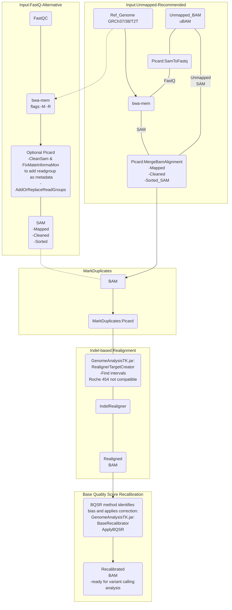

# Mapping & Pre-processing
## GATK best practices
### Notes:

* Bwa-mem mapping tool for genomics data.
* Star v2 for RNA-Seq data.
* uBAM recommended over FastQ

(How to) Generate an unmapped BAM from FASTQ or aligned BAM : [Convert FastQ to uBAM](https://gatk.broadinstitute.org/hc/en-us/articles/4403687183515--How-to-Generate-an-unmapped-BAM-from-FASTQ-or-aligned-BAM)

(How to) Install all software packages required to follow the GATK Best Practices:[ Install software packages guide ](https://gatk.broadinstitute.org/hc/en-us/articles/360041320571--How-to-Install-all-software-packages-required-to-follow-the-GATK-Best-Practices)

ReadGroup important notes: [Meaning of the read group](https://gatk.broadinstitute.org/hc/en-us/articles/360035890671-Read-groups)

Tag @RG must be present for GATK analysis: [@RG error](https://gatk.broadinstitute.org/hc/en-us/articles/360035532352-Errors-about-read-group-RG-information)

<br />

**Used tools:**

**[bwa-mem:](https://github.com/lh3/bwa)**
BWA is a software package for mapping DNA sequences against a large reference genome, such as the human genome. BWA-MEM is recommended for query sequences longer than ~70bp for a variety of error rates (or sequence divergence).

**[SamToFastq (Picard):](https://broadinstitute.github.io/picard/command-line-overview.html#SamToFastq)**
Converts a SAM or BAM file to FASTQ. This tool extracts read sequences and base quality scores from the input SAM/BAM file and outputs them in FASTQ format. This can be used by way of a pipe to run BWA MEM on unmapped BAM (uBAM) files efficiently.

Usage example:

```
java -jar picard.jar SamToFastq \
     I=input.bam \
     FASTQ=output.fastq
```
<br />


**[MergeBamAlignment (Picard):](https://broadinstitute.github.io/picard/command-line-overview.html#MergeBamAlignment)**
Merge alignment data from a SAM or BAM with data in an unmapped BAM file. This tool produces a new SAM or BAM file that includes all aligned and unaligned reads and also carries forward additional read attributes from the unmapped BAM (attributes that are otherwise lost in the process of alignment). The purpose of this tool is to use information from the unmapped BAM to fix up aligner output. The resulting file will be valid for use by other Picard tools. For simple BAM file merges, use MergeSamFiles. Note that MergeBamAlignment expects to find a sequence dictionary in the same directory as REFERENCE_SEQUENCE and expects it to have the same base name as the reference FASTA except with the extension ".dict". If the output sort order is not coordinate, then reads that are clipped due to adapters or overlapping will not contain the NM, MD, or UQ tags.

Usage example:
```
java -jar picard.jar MergeBamAlignment \
       ALIGNED=aligned.bam \ 
       UNMAPPED=unmapped.bam \ 
       O=merge_alignments.bam \
       R=reference_sequence.fasta
```
<br />

**[MarkDuplicates (Picard):](https://broadinstitute.github.io/picard/command-line-overview.html#MarkDuplicates)**
Identifies duplicate reads.

This tool locates and tags duplicate reads in a BAM or SAM file, where duplicate reads are defined as originating from a single fragment of DNA. Duplicates can arise during sample preparation e.g. library construction using PCR. See also EstimateLibraryComplexity for additional notes on PCR duplication artifacts. Duplicate reads can also result from a single amplification cluster, incorrectly detected as multiple clusters by the optical sensor of the sequencing instrument. These duplication artifacts are referred to as optical duplicates.

Usage example:
```
java -jar picard.jar MarkDuplicates \
      I=input.bam \
      O=marked_duplicates.bam \
      M=marked_dup_metrics.txt
```
<br />

**[BaseRecalibrator](https://gatk.broadinstitute.org/hc/en-us/articles/21905050792603-BaseRecalibrator)**
First pass of the base quality score recalibration. Generates a recalibration table based on various covariates. The default covariates are read group, reported quality score, machine cycle, and nucleotide context.

Usage example:
 ```
 gatk BaseRecalibrator \
   -I my_reads.bam \
   -R reference.fasta \
   --known-sites sites_of_variation.vcf \
   --known-sites another/optional/setOfSitesToMask.vcf \
   -O recal_data.table
   ```

<br>

**[ApplyBQSR](https://gatk.broadinstitute.org/hc/en-us/articles/21905038144155-ApplyBQSR)**
This tool performs the second pass in a two-stage process called Base Quality Score Recalibration (BQSR). Specifically, it recalibrates the base qualities of the input reads based on the recalibration table produced by the BaseRecalibrator tool, and outputs a recalibrated BAM or CRAM file.

Usage example:
 ```
 gatk ApplyBQSR \
   -R reference.fasta \
   -I input.bam \
   --bqsr-recal-file recalibration.table \
   -O output.bam
 ```

<br>


### Optional:
**If using FastQ as input:**

**[CleanSam (Picard):](https://broadinstitute.github.io/picard/command-line-overview.html#CleanSam)**
Cleans the provided SAM/BAM, soft-clipping beyond-end-of-reference alignments and setting MAPQ to 0 for unmapped reads

<br />

**[FixMateInformation (Picard):]()**
Verify mate-pair information between mates and fix if needed.This tool ensures that all mate-pair information is in sync between each read and its mate pair. If no OUTPUT file is supplied then the output is written to a temporary file and then copied over the INPUT file. Reads marked with the secondary alignment flag are written to the output file unchanged.

Usage example:
```
java -jar picard.jar FixMateInformation \
       I=input.bam \ 
       O=fixed_mate.bam
```
<br>

**[AddOrReplaceReadGroups (Picard)]()**
Replace read groups in a BAM file.This tool enables the user to replace all read groups in the INPUT file with a single new read group and assign all reads to this read group in the OUTPUT BAM file.

For more information about read groups, see the GATK Dictionary entry.

This tool accepts INPUT BAM and SAM files or URLs from the Global Alliance for Genomics and Health (GA4GH) see [GA4GH](http://ga4gh.org/#/documentation).

Usage example:
```
java -jar picard.jar AddOrReplaceReadGroups \
      I=input.bam \
      O=output.bam \
      RGID=4 \
      RGLB=lib1 \
      RGPL=illumina \
      RGPU=unit1 \
      RGSM=20
```
<br>

*Indel Realignment is deprecated from v4.

<br>
## Mapping workflow

