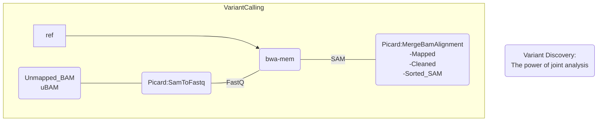

```mermaid


flowchart TD;
var(Variant Discovery:\nThe power of joint analysis)
    click var href "https://drive.google.com/drive/folders/0BwTg3aXzGxEDR2JKTUIxVGxCT1k?resourcekey=0-Y4tV1putQCzgF7j504BIHg"

    subgraph VariantCalling
    ref----> bam_output
    UM(Unmapped_BAM\nuBAM)----pi(Picard:SamToFastq)--FastQ---bam_output(bwa-mem)--SAM----pik(Picard:MergeBamAlignment\n-Mapped\n-Cleaned\n-Sorted_SAM)
    
    
    
    end


%%Comment


```