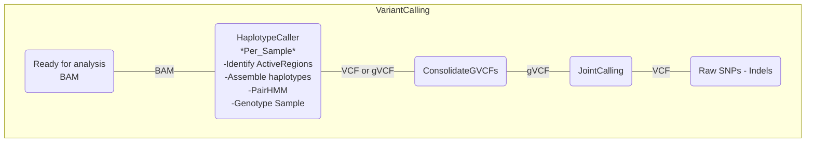

# Variant Calling

## GATK best practices

This file provides an introduction to the tools and good practices workflow used for variant calling in gatkv4.0.

Notes:
**Bwa-mem mapping tool for genomics data.
Star v2 for RNA-Seq data.
uBAM recommended over FastQ
(How to) Generate an unmapped BAM from FASTQ or aligned BAM : Convert FastQ to uBAM**

Software packages:


Used tools:

[**SamToFastq (Picard):**](https://gatk.broadinstitute.org/hc/en-us/articles/360036485372-SamToFastq-Picard) Converts a SAM or BAM file to FASTQ. Extracts read sequences and qualities from the input SAM/BAM file and writes them intothe output file in Sanger FASTQ format.

Usage example:
```
java -jar picard.jar SamToFastq 
     I=input.bam
     FASTQ=output.fastq
```

[**HaplotypeCaller:**](https://gatk.broadinstitute.org/hc/en-us/articles/360037225632-HaplotypeCaller)Call germline SNPs and indels via local re-assembly of haplotypes
The HaplotypeCaller is capable of calling SNPs and indels simultaneously via local de-novo assembly of haplotypes in an active region.

Usage example: Single-sample GVCF calling (outputs intermediate GVCF)

```
 gatk --java-options "-Xmx4g" HaplotypeCaller  \
   -R Homo_sapiens_assembly38.fasta \
   -I input.bam \
   -O output.g.vcf.gz \
   -ERC GVCF
```
<br><br>

## Variant Calling workflow

