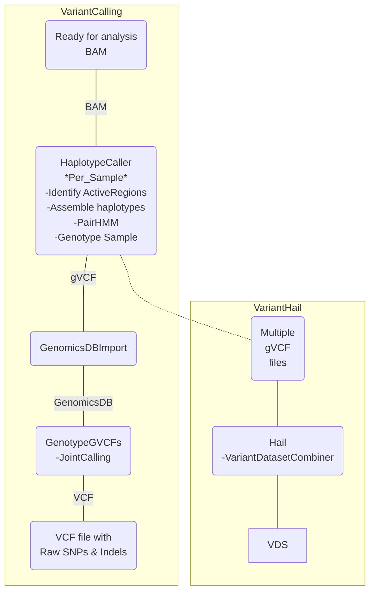

# Variant Calling

## GATK best practices

This file provides an introduction to the tools and good practices workflow used for variant calling in gatkv4.0.

Notes:

Description and comparison of VCF and GVCF. [ Here](https://gatk.broadinstitute.org/hc/en-us/articles/360035531812-GVCF-Genomic-Variant-Call-Format)

For JointCalling use HaplotypeCaller in gVCF mode [GVCF notes](https://gatk.broadinstitute.org/hc/en-us/articles/360037225632-HaplotypeCaller)

Inputs for GenotypeGCVFs can be of three types:
1) A single single-sample GVCF. 
2) A single multi-sample GVCF created by CombineGVCFs.
3) A GenomicsDB workspace created by GenomicsDBImport. 

Software packages:


Used tools:

[**HaplotypeCaller:**](https://gatk.broadinstitute.org/hc/en-us/articles/360037225632-HaplotypeCaller)Call germline SNPs and indels via local re-assembly of haplotypes
The HaplotypeCaller is capable of calling SNPs and indels simultaneously via local de-novo assembly of haplotypes in an active region.

Usage example: Single-sample GVCF calling (outputs intermediate GVCF)

```
 gatk --java-options "-Xmx4g" HaplotypeCaller  \
   -R Homo_sapiens_assembly38.fasta \
   -I input.bam \
   -O output.g.vcf.gz \
   -ERC GVCF
```

[**GenomicsDBImport:**](https://gatk.broadinstitute.org/hc/en-us/articles/360036883491-GenomicsDBImport) Import single-sample GVCFs into GenomicsDB before joint genotyping.
The GATK4 Best Practice Workflow for SNP and Indel calling uses GenomicsDBImport to merge GVCFs from multiple samples. 

Usage example:

Provide each sample GVCF separately.
```
    gatk --java-options "-Xmx4g -Xms4g" GenomicsDBImport \
      -V data/gvcfs/mother.g.vcf.gz \
      -V data/gvcfs/father.g.vcf.gz \
      -V data/gvcfs/son.g.vcf.gz \
      --genomicsdb-workspace-path my_database \
      --tmp-dir=/path/to/large/tmp \
      -L 20
```
Provide sample GVCFs in a map file.
```
    gatk --java-options "-Xmx4g -Xms4g" \
       GenomicsDBImport \
       --genomicsdb-workspace-path my_database \
       --batch-size 50 \
       -L chr1:1000-10000 \
       --sample-name-map cohort.sample_map \
       --tmp-dir=/path/to/large/tmp \
       --reader-threads 5
```


[**GenotypeGVCFs:**](https://gatk.broadinstitute.org/hc/en-us/articles/360037057852-GenotypeGVCFs)
Perform joint genotyping on one or more samples pre-called with HaplotypeCaller
This tool is designed to perform joint genotyping on a single input, which may contain one or many samples. In any case, the input samples must possess genotype likelihoods produced by HaplotypeCaller with `-ERC GVCF` or `-ERC BP_RESOLUTION`.

Usage example:Perform joint genotyping on GenomicsDB workspace created with GenomicsDBImport  
```

 gatk --java-options "-Xmx4g" GenotypeGVCFs \
   -R Homo_sapiens_assembly38.fasta \
   -V gendb://my_database \
   -O output.vcf.gz
 
```

### Alternative using VDS as in GnomAD 4.0


[**VariantDatasetCombiner:**](https://hail.is/docs/0.2/vds/hail.vds.combiner.VariantDatasetCombiner.html#hail.vds.combiner.VariantDatasetCombiner_) 
A restartable and failure-tolerant method for combining one or more GVCFs and Variant Datasets. 

Usage example:
```
gvcfs = [
    'gs://bucket/sample_10123.g.vcf.bgz',
    'gs://bucket/sample_10124.g.vcf.bgz',
    'gs://bucket/sample_10125.g.vcf.bgz',
    'gs://bucket/sample_10126.g.vcf.bgz',
]

combiner = hl.vds.new_combiner(
    output_path='gs://bucket/dataset.vds',
    temp_path='gs://1-day-temp-bucket/',
    gvcf_paths=gvcfs,
    use_genome_default_intervals=True,
)

combiner.run()

vds = hl.read_vds('gs://bucket/dataset.vds')
```

<br><br>

## Variant Calling workflow

